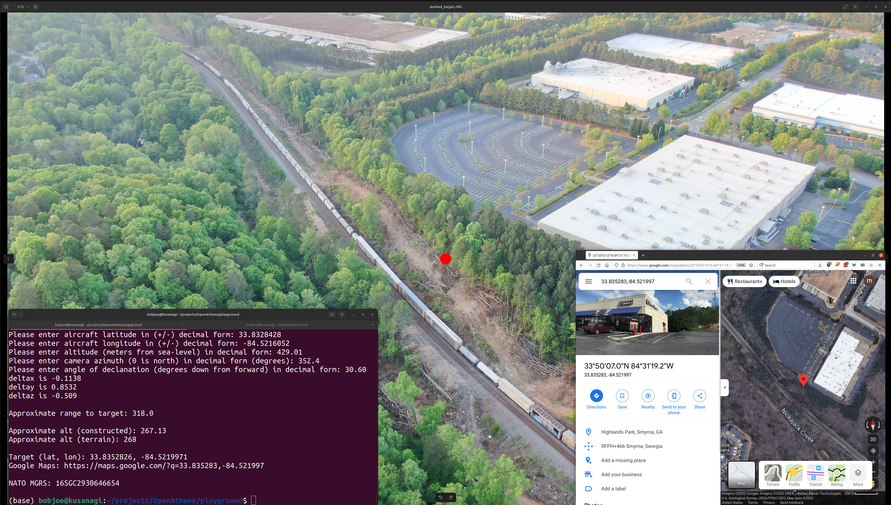
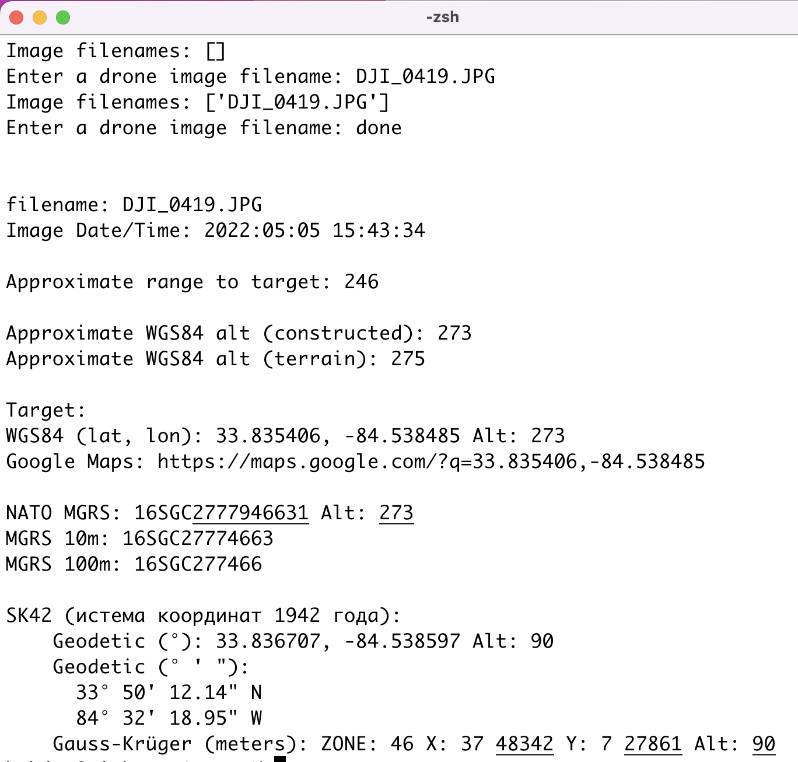
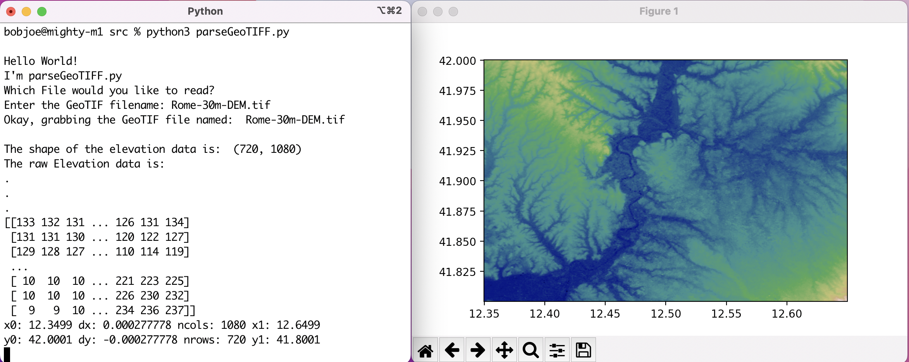

# Open Athena


Open Athena is a project to enable precision indirect fires that disrupt conventional combined arms warfare. This is accomplished by combining consumer rotary-wing aircraft (drones) [sensor data embedded in still images](./drone_sensor_data_blurb.md) with [an offline-ready Digital Elevation Model](./EIO_fetch_geotiff_example.md) to provide the instant location of targets

🖼️👨‍💻 + 🧮⛰️ = 🎯📍

This technique may greatly reduce the incidence of errors during the process of [forward artillery observation](https://en.wikipedia.org/wiki/Artillery_observer), with a profound impact towards reducing harm to civilian lives and property in warfare. OpenAthena may also prove especially useful for life-saving civilian search and rescue (SAR) and other applications

This software is in pre-alpha. Use appropriate caution when using data generated from this program

# [**Premise**](https://github.com/mkrupczak3/OpenAthena#premise-1)
[](https://github.com/mkrupczak3/OpenAthena#premise-1)
[](https://github.com/mkrupczak3/OpenAthena#premise-1)


# [**Installation**](https://github.com/mkrupczak3/OpenAthena#install)


# [**Usage**](https://github.com/mkrupczak3/OpenAthena#usage-1)

---

# Limitations of Indirect Fire in existing combined arms doctrine
While the [importance of indirect fire](causative_agents_blurb.md) (e.g. mortars, artillery, rockets) is well known to military historians, present-day soldiers, and others studied in methods of warfare, it remains an imprecise, blunt, and destructive tool relegated merely to a support role in current combined arms doctrine.

Mastery of combined arms through maneuver warfare and air superiority remain the determinate factors of supremacy in current doctrine, preventing the effective application of indirect fire. This is in large part due to the lack of precision and immediacy that are critical for its usage against a highly-mobile adversary.

As U.S. Army Chief of Staff Gen. Mark A. Milley wrote in the forward to U.S. Army Training and Doctrine Command Pamphlet 525-3-1, [The U.S. Army in Multi-Domain Operations 2028](https://adminpubs.tradoc.army.mil/pamphlets/TP525-3-1.pdf): “emerging technologies” are “driving a fundamental change in the character of war.” They have “the potential to revolutionize battlefields unlike anything since the integration of machine guns, tanks, and aviation which began the era of combined arms warfare.”

# A new introduction to combined arms doctrine

Retired French army general and theory-crafter Guy Hubin writes in [_Perspectives tactiques_](https://warontherocks.com/2021/02/kill-the-homothetic-army-gen-guy-hubins-vision-of-the-future-battlefield/) that the possibility of precision indirect fires is one such fundamental change in the character of war driven by emerging technologies.

With recent advancements in consumer technology and publicly-available terrain datasets, the possibility arises of using inexpensive, low-altitude, un-manned fixed or rotary-wing aircraft to augment the capability of indirect fire. They can achieve this by improving indirect fire's accuracy in usage and providing precise, immediate information on targets to operators of a broad range of existing indirect fire weaponry.

# Proof of concept
Aerial forward artillery observation with small consumer aircraft, even if not employed specifically in this technique, has proven to be very effective in application during the 2022 war in Ukraine.

Examples:

In first-hand accounts (via reporter [@Jack_Watling](https://twitter.com/Jack_Watling)):
[shashj/status/1519041368672415747](https://twitter.com/shashj/status/1519041368672415747)

In reporting (via reporter [@HoansSolo](http://www.w3.org/1999/02/22-rdf-syntax-ns)): [HoansSolo/status/1523955057187860480](https://twitter.com/HoansSolo/status/1523955057187860480)

forward artillery observation for destruction of concentrated armored units:
[Blue_Sauron/status/1524742847664173057](https://twitter.com/Blue_Sauron/status/1524742847664173057)
[kms_d4k/status/1524506214650028032](https://twitter.com/kms_d4k/status/1524506214650028032)

forward artillery observation for counter-battery fire: [Osinttechnical/status/1511867981596434434](https://twitter.com/Osinttechnical/status/1511867981596434434)
[alt video link](counter-battery-example.mp4)

forward artillery observation for indirect-fire adjustment: [Osinttechnical/status/1516473926150463494](https://twitter.com/Osinttechnical/status/1516473926150463494) [alt video link](fire-adjustment-example.mp4)

forward artillery observation for combined arms disruption: [UAWeapons/status/1509247556164935691](https://twitter.com/UAWeapons/status/1509247556164935691)
[alt video link](anti-combined-arms-example.mp4)

forward artillery observation for logistics disruption:
[Osinttechnical/status/1511683706511052808](https://twitter.com/Osinttechnical/status/1511683706511052808)
[alt video link](anti-logistics-example.mp4)

# An upset in combined arms doctrine

This project portends the possibility of one such upset to existing combined arms doctrine. Low cost remote-controlled consumer-grade aircraft are the instrument of such a change in the character of warfare. Such aircraft are easy to operate by infantry units and inexpensive to replace. Meanwhile, when used to guide indirect fire, such aircraft may provide an effective counter to concentrated infantry and armored units of an adversary accustomed to fighting under current combined arms doctrine.

Due to the low altitude operation and inexpensive nature of such aircraft, they can counter concentrated combined arms forces even when higher-altitude air supremacy is not held or may not be achieved against an adversary. In such a fashion, low altitude consumer-grade aircraft upset the role of high-altitude military aircraft as the only effective foil to ground-based combined arms.

Additionally, the combination of existing combined arms with new precision indirect fire capabilities may allow a unit to move more rapidly and gain ground at frightening speeds using classic fire-and-movement tactics. The advantage provided by precision indirect fire is that it can suppress a target from beyond line of sight, reducing the burden of infantry units to suppress a target while a friendly unit is in motion. Well executed maneuvers under such conditions may out-pace a conventional force's ability to react, resupply, and reposition its own defenses.

# Adapting to an upset

Low altitude air supremacy must be considered equally as essential as that of high altitude in existing combined arms doctrine.

Infantry and mechanized units must guard against artillery-observing aircraft. Specialized low-altitude anti-air or electronic countermeasures (ECM) must be developed. Such platforms should be able to deter such aircraft just as easily as they can be deployed

Effort should be made into producing inexpensive 'bird of prey' aircraft that can enforce low-altitude air supremacy and deny an adversary's aerial artillery observation

# Premise


Multi-copter rotary-wing aircraft (e.g. quadrotors, drones, etc.) typically have an on-board 3D A-GPS sensor for position/alt., a magnetometer for compass heading/azimuth,  and a sensitive barometer (atmospheric pressure sensor) for accurate absolute altitude relative to sea level.

They also typically have an "accelerometer" which allows it to stay level with the ground while in flight, and a camera.

The camera starts level with the horizon during normal operation, and the operator can pitch it downwards towards the ground for live camera feed and taking pictures. These pictures store GPS coordinates, altitude, and the azimuth and angle of declination downward (pitch) in their XMP and EXIF metadata (attached with the image)

Given that the lat/long and altitude of the rotary-wing aircraft is known, its azimuth is known, and it is possible to obtain accurate worldwide elevation data (within ~30m) from [this api](https://pypi.org/project/elevation/), Open Athena calculates the position and altitude of the object aimed at by the camera.

An invisible, imaginary mathematical line is traced from the aircraft's camera towards the ground at its heading (azimuth) and angle of declination downwards (theta) from the horizon. The point closest along this line to the aircraft yet reasonably near any geographic lat/long/alt data point is usually the target which the camera is aiming at. This provides the aircraft operator with a latitude, longitude, and elevation of the target to which the camera is aiming in an extremely short period of time.

Such a rapid positional resolution may prove ideal for use by precision indirect fire teams

# Install

This software is in pre-alpha. Use appropriate caution when using data generated from this program

[Python3](https://www.python.org/) (and the included pip package manager) must be installed first

Ensure your version of `pip` is up to date:
```bash
python3 -m pip install --upgrade pip
```

Install the GDAL package with your package manager (i.e. apt, yum, brew, pacman, etc.):

Example (MacOS):
```bash
brew install gdal
```

Then, all you need to do is run `pip3 install matplotlib mgrs pillow`, then run `src/parseGeoTIFF.py` with python3:
```bash
pip3 install matplotlib mgrs pillow
git clone https://github.com/mkrupczak3/OpenAthena.git
cd OpenAthena/src
python3 parseGeoTIFF.py
```

"pip3" and "python3" may just be called "pip" and "python" depending on the configuration of your system

# Usage:

### parseImage.py

[parseImage.py](./src/parseImage.py) can perform automatic extraction and use of EXIF/XMP sensor information from drone photos. This allows for the automatic extraction and use of data including the aircraft camera's lat/lon, altitude, azimuth, and angle of declination (theta). OpenAthena (if provided [terrain elevation data](./EIO_fetch_geotiff_example.md)) will extract and use these values automaticaly to find the location on the ground in the exact center of the image

[](drone_sensor_data_blurb.md)


More info [**here**](drone_sensor_data_blurb.md)

### find_me_mode.py

[`find_me_mode.py`](./src/find_me_mode.py) provides an alternate targeting mode where target match locations are provided in relative terms (bearing, distance, elevation change) from a fixed point for use by on the ground search and rescue teams, short-distance indirect fire teams (e.g. [mortars](https://en.wikipedia.org/wiki/Mortar_(weapon))) and the like


This mode is only intended for short range distances, otherwise will be inaccurate (curvature of the earth, etc.)


<a href="find_me_mode.md"></a>


More info [**here**](find_me_mode.md)

### parseGeoTIFF.py

Run python parseGeoTIFF.py (while in the src directory) for a demonstration of [GeoTIFF](https://en.wikipedia.org/wiki/GeoTIFF) [DEM](https://en.wikipedia.org/wiki/Digital_elevation_model) parsing. The file `Rome-30m-DEM.tif` is provided in the `src` directory as an example. A DEM covering a customized area can be [easily obtained](./EIO_fetch_geotiff_example.md) using the python `elevation` API


(counterintuitively, the x and y axis are backwards in the standard notation of a position via [latitude , longitude])


```
user@mypc:~/projects/OpenAthena/src$
python parseGeoTIFF.py
```


Then, exit the picture window that appears. You will now be prompted in the command line interface for a latitude and longitude, enter lat/long coordinates and the program will give you the approximate elevation using the nearest elevation data point


### getTarget.py


getTarget.py searches along the constructed line (emitted from the camera center) for a terrain match


To start, `cd` into the `src` directory, then run getTarget.py:

```bash
you@yourcomputer src % python3 getTarget.py
```

You should then see the following prompt:
```bash
Hello World!
I'm getTarget.py
Which GeoTiff file would you like to read?
Enter the GeoTIFF filename:
```

You can clip [your own GeoTIFF file](./EIO_fetch_geotiff_example.md) from the [elevation API command line](http://elevation.bopen.eu/en/stable/quickstart.html#command-line-usage), or just use the provided example file `Rome-30m-DEM.tif` which contains the elevation data of the city of Rome, Italy and its outlying area


```bash
Hello World!
I'm getTarget.py
Which GeoTiff file would you like to read?
Enter the GeoTIFF filename: Rome-30m-DEM.tif
```


\[RETURN\]


```bash
The shape of the elevation data is:  (720, 1080)
The raw Elevation data is:
[[133 132 131 ... 126 131 134]
 [131 131 130 ... 120 122 127]
 [129 128 127 ... 110 114 119]
 ...
 [ 10  10  10 ... 221 223 225]
 [ 10  10  10 ... 226 230 232]
 [  9   9  10 ... 234 236 237]]
x0: 12.3499 dx: 0.000277778 ncols: 1080 x1: 12.6499
y0: 42.0001 dy: -0.000277778 nrows: 720 y1: 41.8001


Please enter aircraft latitude in (+/-) decimal form:
```


The preceding numbers are provided for the user as debug information, but are not necessary during normal operation


Next, enter the latitude, then longitude, then altitude of the aircraft (standard WGS84):


```bash
Please enter aircraft latitude in (+/-) decimal form: 41.801
Please enter aircraft longitude in (+/-) decimal form: 12.6483
Please enter altitude (meters from sea-level) in decimal form: 500
Please enter camera azimuth (0 is north) in decimal form (degrees):
```


Next, enter the heading of the aircraft (in degrees, 0 is north and increasing clock-wise) and the angle of declination \[theta\] of the camera (in degrees, 0 is straight forward and increasing up to a maximum of 90 which is straight downwards)


The accuracy of the positional resolution is better at steep angles (high theta) when the camera is not close to parallel with the ground near the target


```bash
Please enter camera azimuth (0 is north) in decimal form (degrees): 315
Please enter angle of declination (degrees down from forward) in decimal form: 20

Approximate range to target: 1031

Approximate WGS84 alt (constructed): 148
Approximate alt (terrain): 148

Target:
WGS84 (lat, lon): 41.807161, 12.640036 Alt: 148
Google Maps: https://maps.google.com/?q=41.807161,12.640036

NATO MGRS: 33TUG0395831058 Alt: 148
MGRS 10m: 33TUG03953105
MGRS 100m: 33TUG039310

SK42:
    Geodetic (°): 41.807634, 12.641757 Alt: 98
    Geodetic (° ' "):
      41° 48' 27.48" N
      12° 38' 30.33" E
    Gauss-Krüger (meters): ZONE: 3 X: 46 33042 Y: 3 4021 Alt: 98

```

The distance of each iterative step, in meters, is defined by the `increment` variable in `getTarget.py`


The information in the following output lines represents the final positional resolution obtained by the approximate intersection of the constructed line emitted from the aircraft's camera and the ground as represented by the terrain data


The values should be tested for correctness


`Approximate range to target:` represents the direct-line distance in meters from the aircraft to the target. This may be useful for an operator to determine if the target match is in the expected place. To obtain the horizontal distance, multiply this number times the cosine of theta


`Approximate alt (constructed)` represents the aproximate altitude (in meters from sea level) of the target according to the altitude of the last iteration along the constructed line


`Approximate alt (terrain):` represents the aproximate altitude (in meters from sea level) of the target according to the terrain data point closest to the final lat./lon. pair


`WGS84 (lat, lon):` represents the latitude and longitude of the target to which the camera is likely aiming at. These values, in degrees, are from the common [WGS84 coordinate system](https://en.wikipedia.org/wiki/World_Geodetic_System)
`Google Maps:` a link to the previous lat/lon on Google Maps. Each rounded to 6 decimal places


`NATO MGRS:` represents the target location in the [NATO Military Grid Reference System (MGRS)](https://en.wikipedia.org/wiki/Military_Grid_Reference_System), which is simmilar to [UTM](https://en.wikipedia.org/wiki/Universal_Transverse_Mercator_coordinate_system). The first 4 (or 5) digits defines the Grid Zone Designator (GZD). The next 10 digits represent the Grid Ref (1 meter square) of the target. The 10 digits of the grid, as well as the Altitude, are underlined in the output for easy reference.


`MGRS 10m:` same as `NATO MGRS:` except as an 8 digit (10m square) containing the target


`MGRS 100m:` same as `MGRS 10m:` except as a 6 digit (100m square) containing th target


`SK42 (истема координат 1942 года):` represents the target location according to the [SK-42 (A.K.A. CK-42) coordinate system](https://en.wikipedia.org/wiki/SK-42_reference_system) (Russian: Система координат 1942 года). This system is commonly used in old Soviet and post-Soviet style maps, and is based on a different ellipsoidal projection than WGS84 (called the  Krassowsky 1940 ellipsoid)
`    Geodetic (°)` represents the target location as latitude and longitude degrees outward from the center of the Krassowsky ellipsoid.
`    Geodetic (° ' ")` The same value, split up into degrees, minutes, and seconds. Old Soviet style maps are commonly marked by degree (°) and minute (') on the axes as subscript.
`    Gauss-Krüger (meters):` The same value, as a offest value (in meters)on a [Gauss-Krüger](https://desktop.arcgis.com/en/arcmap/latest/map/projections/gauss-kruger.htm) projection. The last 5 digits of the offset Northing and Easting values are commonly used as grid labels on old Soviet style maps. "Northing" refers to a vertical line defined by an `X` value. "Easting" refers to a horizontal line defined by a `Y` value. `ZONE` specifies the GK longitudinal-zone (in 6° increments, possible values 1-60 inclusive). The smallest 5 digits of the Northing and Easting values, as well as the Altitude, are underlined in the output for easy reference.


The program `getTarget.py` will then exit


# Military Uses
Especially when employed with precision smart munitions (e.g. [artillery](https://asc.army.mil/web/portfolio-item/ammo-excalibur-xm982-m982-and-m982a1-precision-guided-extended-range-projectile/), aerial, etc.) this project will greatly aid the safety and processes of the [forward artillery observer](https://en.wikipedia.org/wiki/Artillery_observer) using soley inexpensive consumer electronics, all while reducing the risk of operator error (mismeasurement, miscalculation, etc.) and subsequent risk of friendly-fire incidents and risk to civilian lives.

In addition: unlike a laser rangefinder/designator,  a passive optical-based approach to target identification does not emit any signature which may forewarn a target or a group of targets (including armored vehicles). This may be highly beneficial depending on the usage environment.

# Civilian Uses

This technology can be used for search and rescue operations, wildfire detection and management, measuring and surveying for civic engineering, and many other commercial purposes.

# US Arms export control notice
This software falls under the [Dual Use Technology](https://en.wikipedia.org/wiki/Dual-use_technology#United_States) category under applicable U.S. arms export control laws. If you are using this software in a country that is under restriction from the United States under the Arms Export Control Act, you may only use this for civilian purposes and may not use this software in conflict. This author is not responsible for unauthorized usage of this open source project
