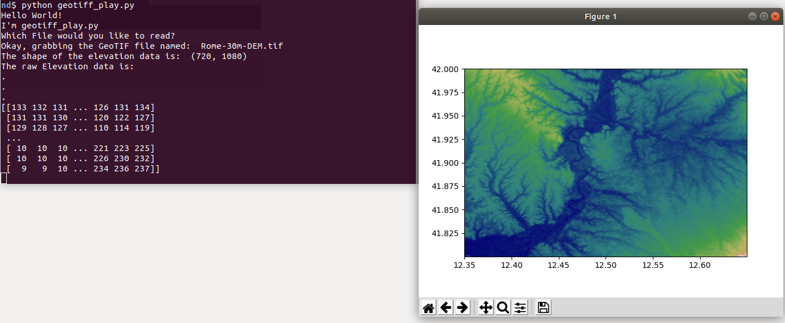

# OpenAerialForwardArtilleryObservation
Learning python API's by making an experimental line-of-sight + avionics sensor + geodata synthesis calculator

This is only an academic exercise, I may eventually try to implement this for simple programming experience with Python API's and to test the viability of the software premise and the accuracy of consumer electronic sensors (probably not though)

I'm surprised no one else has made something like this

# Current status
run ./playrground/geotiff_play.py for a demonstration of geotiff parsing and a render of the City of Rome in Italy and its outlying terrain. Chart labels represent longitude and latitude (counterintuitively, the x and y axis are backwards in the standard description of a position via [latitude , longitude])


Using decimal lat/long, because no one has time for parsing degrees, minutes, seconds format.

```
user@mypc:~/projects/OpenAerialForwardArtilleryObservation$
python geotiff_play.py
```



# Premise


Multi-copter rotary-wing aircraft (e.g. quadroters, drones, etc.) typically have an onboard 3D A-GPS sensor for position/alt., a magnetometer for compass heading/azimuth,  and a sensitive barometer (atmospheric pressure sensor) for accurate absolute altitude relative to sea level.

They also typically have an "accelerometer" which allows it to stay (very?) level with the ground while in flight, and a camera.

Ideally for this purpose, the camera would point at horizon level during normal operation, and could be aimed at an angle <= 90 deg downward from the horizon at a target (while giving a very specific measure of its angle of declanation).

Given that the lat/long and altitude of the rotary-wing aircraft is known, its azimuth is known, and it is possible to obtain accurate worldwide elevation data (within ~30m ?) from [this api](https://pypi.org/project/elevation/), it should be a very simple math problem to calculate the position and altitude of the object aimed at by the camera.

If an invisible, imaginary mathematical line was "paramaterized" from the aircraft's camera towards the ground at its angle of declanation, the point farthest along this line but closest to any geographic lat/long/alt data point is likely to be the target which the camera is aiming at. This would provide the aircraft operator with a rough latitude, longitude, and elevation of the target to which the camera is aiming in an extremely short period of time.

# Uses
Especially when employed with GPS-guided munitions (artillery, stuff dropped outta planes, whatever) this would greatly aid the safety and processes of the [forward artillery observer](https://en.wikipedia.org/wiki/Artillery_observer) using soley inexpensive consumer electronics, all while reducing the risk of operator error (mismeasurement, miscalculation, etc.) and subsequent risk of friendly-fire incidents and risk to civilian lives.

Also, much more practical but much less fun-sounding, it could be used for search and rescue operations, measuring and surveying for civic engineering (or something), and many other commercial purposes.

# US Arms export control notice
If you are using this software in a country that is under restriction from the United States under the Arms Export Control Act, you may only use this for practical purposes and may not use this software in conflict.
