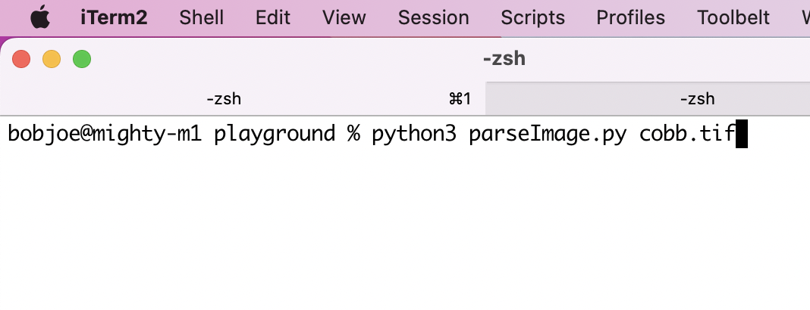
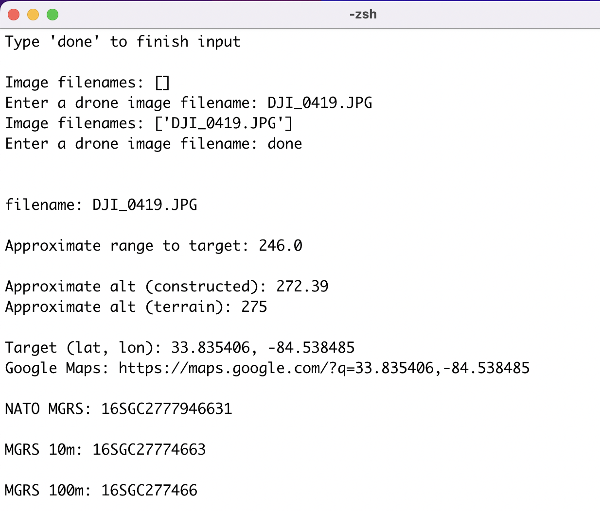
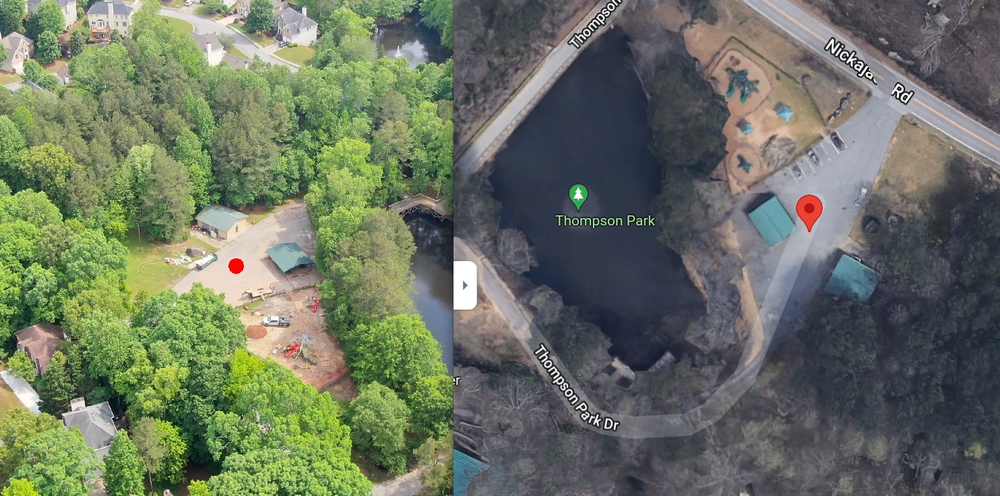

# Getting sensor data

The consumer models of some drones do not display their position, altitude, camera heading, and camera declanation during flight, but do store this data in the [EXIF](https://en.wikipedia.org/wiki/Exif) and [XMP](https://en.wikipedia.org/wiki/Extensible_Metadata_Platform) metadata of their still image captures

### parseImage.py

[parseImage.py](./playground/parseImage.py) has an experimental feature for automatic extraction and use of EXIF/XMP sensor information from drone photos

parseImage.py can be run in an **interactive** mode, or **headless** mode based on how many arguments are given after `python parseImage.py`. **Interactive** is designed for use by humans with one or more images, **headless** is designed for use by automation with one or more images. The output of **headless** mode is subject to change in future versions

#### interactive

Before using parseImage.py, make sure you have a valid geoTiff file that covers at least the location of the drone and the possible location of its subject. One way to do this is to get the drone's location from an [image's metadata](drone_sensor_data_blurb.md#manual-extraction), then [clip a geoTiff file of the surrounding area](./playground/EIO_fetch_geotiff_example.md)

Next, choose an image for which to resolve the location of its subject. For example `DJI_0419.JPG`:


Finally, run `parseImage.py`. To save time, the geoTiff file can be provided as the first argument after `python parseImage.py` (or `python3 parseImage.py` on Macs for example):
```bash
python parseImage.py bartow.tif
```
(Note: the file must end in `.tif`. If you do not provide a geoTiff file, you will be prompted for input of a filename)



**RETURN**


Enter the full file path of the drone image if it is not in the `playground` directory. Otherwise, just input the image filename and press **RETURN**

Multiple images can be processed at once in **interactive** mode. When you're finished inputing images, type **`done`** to begin processing



Let's copy that `NATO MGRS` into Google Maps:


Pretty good!

#### headless

If `parseImage.py` is given any additional arguments after a geoTiff file, it will be run in **headless** mode. It will try to read each argument (past the geoTiff file) as an image filename. It will try to resolve a target and put a resolved location in a file IMAGENAME.ATHENA for each image.

Image parsing can fail for any image for a variety of reasons, including the search running out of bounds, location not covered by the geoTiff, etc. However, an IMAGENAME.ATHENA file will only be generated where both the image metadata extraction and the terrain search process were sucessful

In a future version, these files of extention `.ATHENA` will be replaced by `.gpx` and be of the [GPS Exchange Format](https://en.wikipedia.org/wiki/GPS_Exchange_Format)

### manual extraction

One tool to view EXIF and XMP metadata on Mac, Linux, and Windows is Phil Harvey's (not affiliated with this project) [exiftool](https://exiftool.org/)

An equivalent command line tool available on Mac and Linux is [exiv2](https://exiv2.org/) (also not affiliated)


The following is an example of a command to show the sensor metadata of an image taken from a particular DJI drone:
```bash
exiv2 -P kt DJI_1234.JPG | grep -i "gimbal\|latitude\|longitude\|alt"
```


`drone-dji.GimbalYawDegree` is the direction of the aircraft's camera, from -180 (exclusive) to +180 (inclusive). 0 degrees is North, 90 is East, -90 is West, etc. Internally this number is converted to an `azimuth` for use by OpenAthena


`drone-dji.GimbalPitchDegree` is the amount of pitch of the camera's gimbal. While the DJI displays this number as negative, Internally the absolute value of this number `theta` is used for OpenAthena. Values of below -90 (straight down) produce undefined behavior and are prohibitted from being entered during manual data input